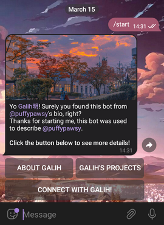

# About Me Telegram Bot

## 🔗 About this project


Telegram bot to describe yourself. Using Python and based on Pyogram.

## ⚡️ How to setup?
Very easy. Can deploy using Heroku or install locally.

### 🚀 Using Heroku
Video tutorial? Coming Soon.
1. Create a [GitHub account](https://github.com/signup?source=login) (if you don't have one).
2. [Fork](https://github.com/galihpujiirianto/AboutMe-tgbot/fork) this repository first.
3. Edit the [msg_config.py](./msg_config.py) file, and change the string as needed.
> Instructions for filling in the strings have been provided in the file, please pay close attention to the filling sentences.
4. Create a [Heroku account](https://heroku.com/signup), then [create a new app](https://dashboard.heroku.com/new-app).
5. After creating your account and app on Heroku, go to the "Deploy" tab (3 buttons from the left), then connect the GitHub account that forked this repository.
6. Find the repository that was forked earlier, then click "Connect".
7. Go to the "Settings" tab (rightmost button), then scroll until you find "Config Vars". Click "Reveal Config Vars".
8. Fill in the variables as in Vars.
9. Still in the "Settings" tab, scroll until you find "Buildpacks", then click "Add Buildpack" then select "heroku/python".
10. Return to the "Deploy" tab, then scroll and click "Deploy Branch". Wait for the process to finish.
11. When finished, click "More", then click "View logs". If it is successful, then the bot has been successfully executed.

### 💻 Local installation
1. Before running, install Git and Python first.
2. Clone this repository and go to the folder - `git clone https://github.com/galihpujiirianto/AboutMe-tgbot.git && cd AboutMe-tgbot`
3. Install required packages - `pip3 install -r requirements.txt`
4. Fill in the variables as in Vars - `nano .env`
> After filling in the variables correctly, press `CTRL + S` and `CTRL + X` to save.
5. Edit the string in [msg_config.py](./msg_config.py) - `nano msg_config.py`
> After filling in the string correctly, press `CTRL + S` and `CTRL + X` to save.
6. Run the bot - `bash start`

## 📎 Vars
After cloning the repository and install the package, create an `env` file and fill in the following variables:
```
API_ID = get it from https://my.telegram.org/apps
API_HASH = get it from https://my.telegram.org/apps
TOKEN = Create a new bot on Telegram using https://t.me/BotFather
```

## 📃 String Editing
Open the [msg_config.py](./msg_config.py) file, and change the string as needed.
> Instructions for filling in the strings have been provided in the file, please pay close attention to the filling sentences.

## ✍🏻 Support, Credits, License, etc
Reach out your problem to the maintainer at [Telegram Group Support](https://t.me/GalonSupport).

If you want this repository to stay active, please help us with:
- Add a [GitHub Star](https://github.com/galihpujiirianto/AboutMe-tgbot) to this project,
- Fork this repo :)
- Write interesting articles about the project on [Dev.to](dev.to), [Medium](medium.com) or your personal blog,
- or you can donate through [Saweria](https://saweria.co/galihpujiirianto).

First off, thanks for taking the time to contribute! Contributions are what make the open-source community such an amazing place 
to learn, inspire, and create. Any contributions you make will benefit everybody else and are **greatly appreciated**.

This project is licensed under the GNU General Public License v3. See [LICENSE](./LICENSE) for more information.

Thank you for:
- [Me](https://github.com/galihpujiirianto) for created this manually,
- [Dion](https://github.com/SeorangDion) for correcting an existing error,
- [Pyrogram](https://github.com/pyrogram/pyrogram) for this code to work.

And thanks to all the code samples that are on the Internet.
